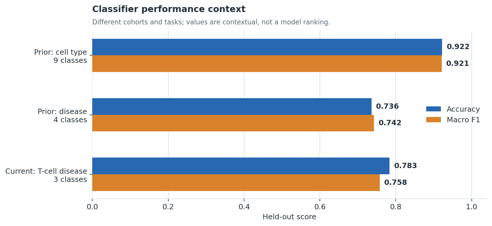
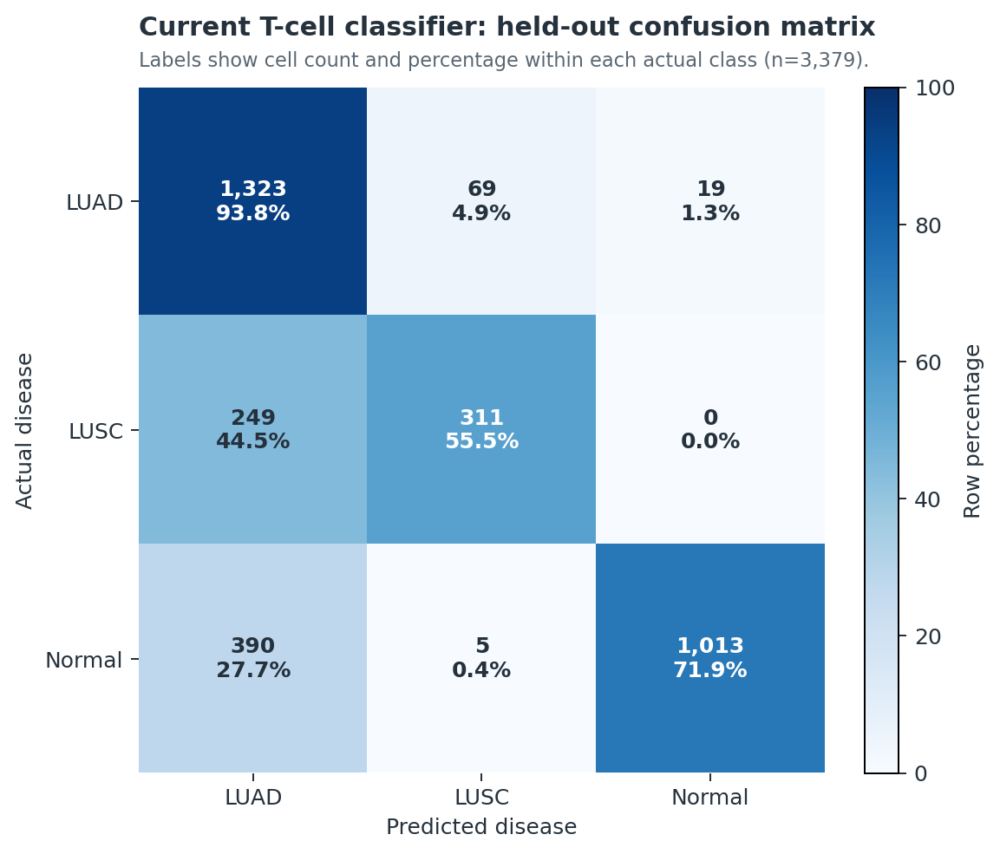
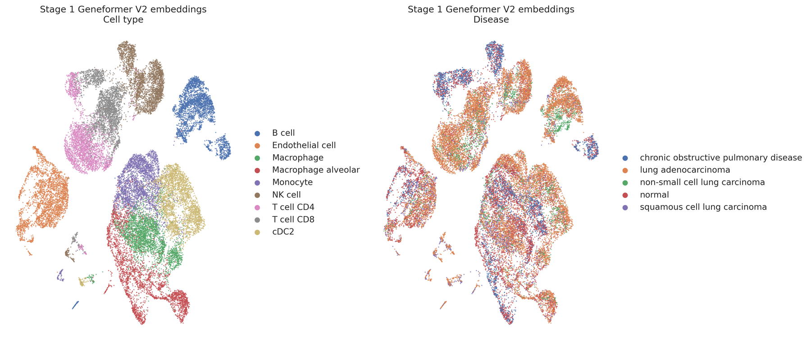
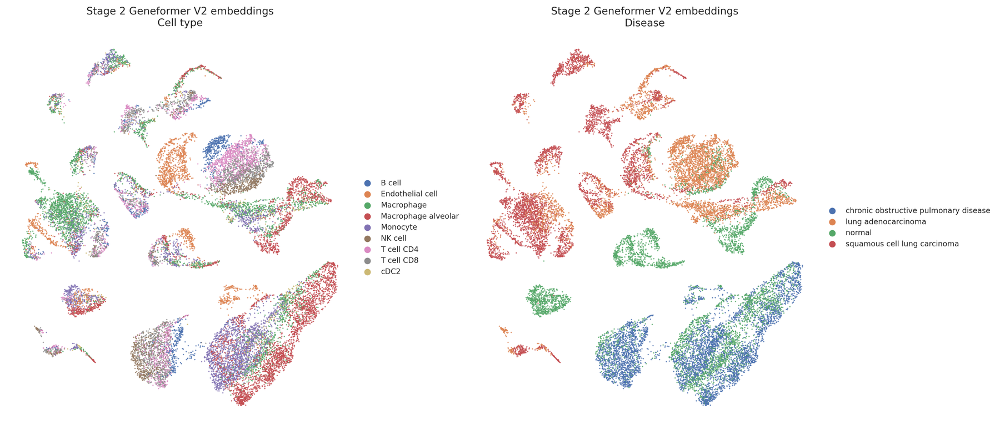

# Geneformer lung T-cell workflow (NSCLC + SCLC)

For moving the active Geneformer experiment, trained model, perturbation
outputs, and reporting environment to another machine, see the
[reproducible migration workspace](migration/README.md).

For creating a project-agnostic Geneformer environment with `uv` on a clean
machine, see the [general Geneformer + uv setup](geneformer_uv_setup/README.md).

This branch prioritizes the **17 July 2026** donor-held-out Geneformer workflow:
21,000 naturally balanced CD4/CD8 T cells, a three-state LUAD/LUSC/normal
classifier, and an all-gene in silico deletion screen.

**Recent highlight:** the [SCLC validation program](#recent-highlight-sclc-validation-program)
extends the workflow to small cell lung cancer — feasibility audit, an
SCLC/LUAD/normal classifier with a targeted perturbation panel, and orthogonal
spatial validation.

## Current experiment

| Dataset | Donor control | Test performance | Perturbation |
|---|---|---|---|
| 7,000 LUAD + 7,000 LUSC + 7,000 normal; no oversampling | No donor crosses train/eval/test | Accuracy **0.7834**; macro F1 **0.7577** | **2,937,776** held-out cell-gene deletions complete; 6/6 comparisons generated |

**Workflow:** atlas selection → donor-disjoint split → Geneformer V2 tokenization
→ fine-tuning → held-out evaluation → all-gene deletion.

[Overview](current_workflow/README.md) ·
[Methods](current_workflow/METHODS.md) ·
[Results](current_workflow/RESULTS.md) ·
[Live run status](current_workflow/monitoring/GPU_PROGRESS_REPORT.md)

## Recent highlight: SCLC validation program

Three-part extension of the T-cell workflow to small cell lung cancer:
**data feasibility audit → SCLC/LUAD/normal classifier + targeted perturbation
panel → orthogonal spatial validation.**

### Cohorts (feasibility audit: **GO, with conditions**)

| Source | Role | Content |
|---|---|---|
| HTAN/CELLxGENE T-cell object | Primary single-cell cohort | **46,140 T cells, 42 donors**: 11,791 SCLC (19 donors), 29,829 LUAD (22), 4,520 normal (4); all 21 pre-registered signature genes present |
| GSE263196 (10x Visium) | Orthogonal spatial validation | 5 SCLC samples, **15,774** in-tissue spots; all 21 signature genes present |
| OMIX002441 | Cross-platform sensitivity cohort | 1,039 T cells, 11 patients; all signature genes Geneformer-tokenable |

[Full audit report](sclc_validation/audit/SCLC_DATA_FEASIBILITY_AUDIT.md)

### SCLC/LUAD/normal T-cell classifier

Donor-disjoint split (leakage check **PASS**), Geneformer V2 104M fine-tune.
Held-out test: accuracy **0.919**, macro F1 **0.903**.

| Class | Precision | Recall | F1 | Test cells (donors) |
|---|---:|---:|---:|---|
| LUAD | 0.926 | 0.959 | **0.942** | 6,386 (4) |
| Normal | 0.847 | 0.986 | **0.911** | 566 (1) |
| SCLC | 0.922 | 0.800 | **0.857** | 2,424 (3) |

*Caveat: the normal class rests on a single test donor — a single-patient data
point, not a population estimate.*

### Targeted 50-gene perturbation panel

50 genes (21 pre-registered immune panel + 29 top drivers from the prior
screen), delete **and** overexpress, across all three source states — **300
gene-runs, all complete**. **123 concordant hits** (both arms FDR < 0.05,
opposite-sign shift); **43 fully donor-consistent**.

| Finding | Detail |
|---|---|
| Internal positive control | **ASCL1 / NEUROD1** (canonical SCLC master regulators) give the strongest concordant SCLC→LUAD signal — the pipeline recovers known tumor biology |
| Robust panel hits | TIGIT, GZMH, CCR7, NKG7, TCF7, IL7R, SLAMF6, CTLA4, HAVCR2, IFNG — exhaustion/cytotoxicity vs. progenitor axis, backed by 1,000+ detections |
| Caution flags | HBA1/HBB, HSPA1B, RPS26, S100A8/9 — contamination/stress candidates pending the biological evaluation pipeline |

[Workflow](sclc_validation/perturbation_workflow/README.md) ·
[Panel results](sclc_validation/perturbation_workflow/targeted_panel/RESULTS.md)

### Orthogonal spatial validation (GSE263196 Visium)

The pre-registered T-cell dysfunction signature is enriched in T-cell-rich SCLC
tissue regions: pooled **ρ = 0.161, 95% CI [0.146, 0.176]**, significant in 4 of
5 samples individually (p < 1e-3).

| Sample | Spots | ρ | 95% CI |
|---|---:|---:|---|
| SCLC3 | 3,849 | 0.028 | [-0.004, 0.059] |
| SCLC4 | 2,709 | 0.154 | [0.117, 0.190] |
| SCLC8 | 3,030 | 0.070 | [0.035, 0.106] |
| SCLC9 | 3,519 | **0.404** | [0.376, 0.431] |
| SCLC12 | 2,525 | 0.116 | [0.077, 0.154] |
| **Pooled** | **15,632** | **0.161** | **[0.146, 0.176]** |


[](sclc_validation/spatial_validation/figures/spatial_tissue_validation_panel.png)

[Spatial validation design and methods](sclc_validation/spatial_validation/README.md)

## In silico perturbation concept


Each expressed gene token is deleted once, the fine-tuned model recalculates the
cell embedding, and movement is scored toward LUAD, LUSC, and normal reference
states. This image is conceptual; quantitative results come from the held-out
deletion screen.

## Key findings



The earlier whole-cohort classifiers and today's T-cell classifier address
different tasks; this chart provides context, not a head-to-head ranking.



The final model detects LUAD strongly. Its main limitation is LUSC recall, with
249 of 560 held-out LUSC cells called LUAD. This ambiguity is explicitly
considered when interpreting perturbation directions.

## UMAPs from prior fine-tuned models

| Stage 1: cell-type model | Stage 2: disease model |
|---|---|
|  |  |

Stage 1 embeddings organize strongly by cell identity. Stage 2 shifts the
representation toward disease structure while retaining overlap. These are
archived models and provide context for today's T-cell-specific workflow.

## Repository map

```text
current_workflow/               active fine-tuning, results, monitor, visuals
sclc_validation/                SCLC audit, SCLC/LUAD/normal perturbation, spatial validation
archive/prior_nsclc_workflow/   Step1-Step7 notebooks and earlier evidence
requirements.txt                lightweight environment specification
```

Large atlases, tokenized datasets, embeddings, checkpoints, and model weights
remain outside Git.
