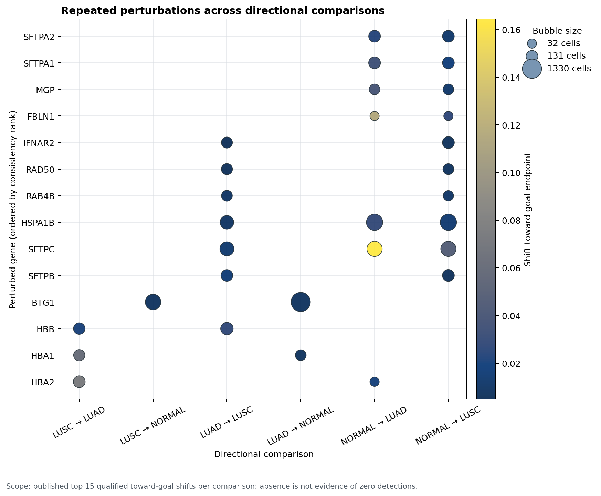
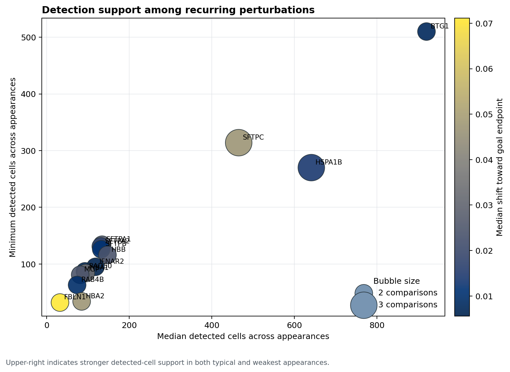

# Cross-comparison perturbation detection consistency

## Technical summary

Within the published top-15 qualified shifts for each of six directional comparisons,
**14 genes recur in at least two comparisons**. The highest-coverage genes are
**SFTPC, HSPA1B, BTG1**. Ranking prioritizes the number of comparisons represented, then the minimum
detected-cell count (a conservative consistency criterion), then the median count.

Bubble area represents `N_Detections`; color represents the positive shift toward the goal
endpoint. Empty cells mean the gene was not in that comparison's published top 15, not that
the gene was untested or had zero detections.

This second view compares typical support (median detected cells) with worst-observed support
(minimum detected cells). Bubble area is comparison coverage; upper-right genes have stronger
support by both measures.

## Highest recurring detection counts

| Rank | Gene | Comparisons | Minimum cells | Median cells | Maximum cells | Median goal shift |
|---:|---|---:|---:|---:|---:|---:|
| 1 | SFTPC | 3/6 | 314 | 465.0 | 465 | 0.0473 |
| 2 | HSPA1B | 3/6 | 270 | 641.0 | 641 | 0.0140 |
| 3 | BTG1 | 2/6 | 510 | 920.0 | 1330 | 0.0076 |
| 4 | SFTPA1 | 2/6 | 134 | 134.0 | 134 | 0.0267 |
| 5 | SFTPA2 | 2/6 | 131 | 131.0 | 131 | 0.0173 |
| 6 | SFTPB | 2/6 | 126 | 132.0 | 138 | 0.0112 |
| 7 | HBB | 2/6 | 116 | 147.0 | 178 | 0.0242 |
| 8 | IFNAR2 | 2/6 | 95 | 118.0 | 141 | 0.0056 |
| 9 | RAD50 | 2/6 | 87 | 92.5 | 98 | 0.0065 |
| 10 | HBA1 | 2/6 | 84 | 94.5 | 105 | 0.0341 |

## Scope and metric definitions

- Source: `source_tables/top_goal_shift_genes.csv` (90 rows: top 15 qualified shifts in each comparison).
- Qualified shifts were previously filtered to `Goal_end_FDR < 0.05`, positive goal shift, and
  `N_Detections >= 25`.
- `comparisons_present` counts directional comparisons in which a gene appears in the published top 15.
- `minimum cells` is the lowest `N_Detections` among those appearances and is used to reward stable support.

## Limitations and next step

This is a consistency check of the **published top-ranked subset**, not the complete perturbation
matrix. A definitive six-comparison consistency analysis requires the six full
`heldout_allgene_<comparison>.csv` files. Once available, the same script should be pointed to those
tables so every tested gene can be distinguished from a gene absent only because of top-15 truncation.
