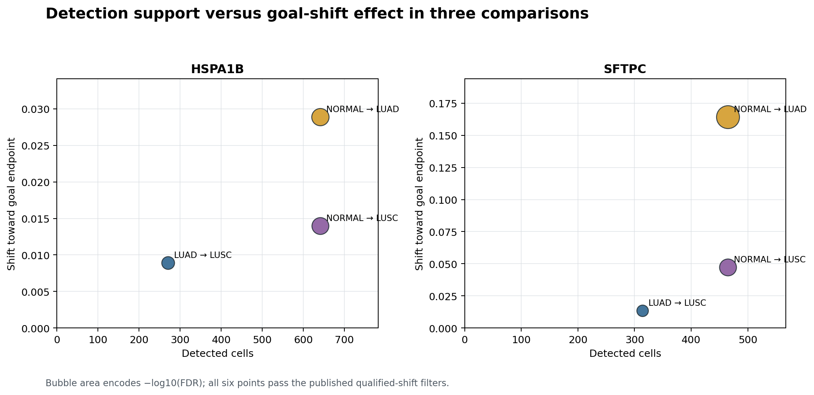
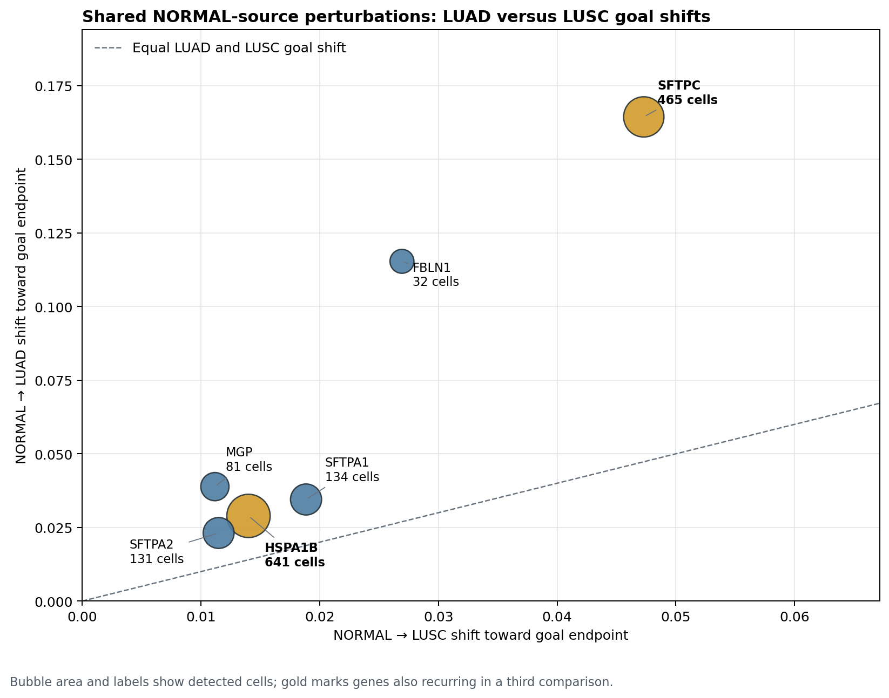
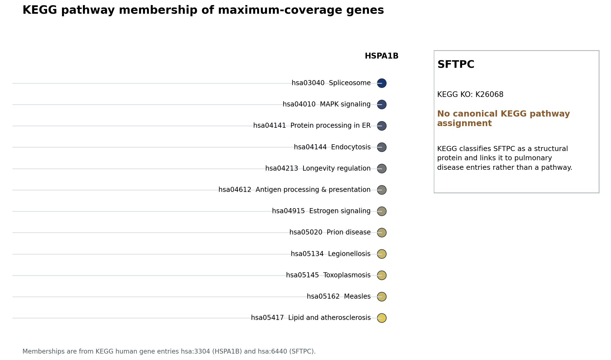

# Maximum-coverage perturbations: SFTPC and HSPA1B

## Technical summary

`SFTPC` and `HSPA1B` are the only genes appearing among the published top 15 qualified
toward-goal shifts in three comparisons—the maximum coverage observed. `HSPA1B` has the
largest detection counts (270–641 cells), while `SFTPC` has the larger goal-shift effects,
especially NORMAL → LUAD (0.1644).

## Detection support and effect size

| Gene | Comparison | Detected cells | Goal shift | FDR |
|---|---|---:|---:|---:|
| HSPA1B | LUAD → LUSC | 270 | 0.0089 | 8.21e-58 |
| HSPA1B | NORMAL → LUAD | 641 | 0.0289 | 1.18e-130 |
| HSPA1B | NORMAL → LUSC | 641 | 0.0140 | 4.59e-123 |
| SFTPC | LUAD → LUSC | 314 | 0.0135 | 2.63e-41 |
| SFTPC | NORMAL → LUAD | 465 | 0.1644 | 6.29e-252 |
| SFTPC | NORMAL → LUSC | 465 | 0.0473 | 5.24e-123 |

## NORMAL-source shifts are consistently larger toward LUAD than toward LUSC

Six genes occur in both published NORMAL-source top-15 lists. Every point lies above the
equal-shift diagonal, meaning its modeled deletion shift toward LUAD is larger than its shift
toward LUSC. `SFTPC` has the largest shift on both axes (465 detected cells), while `HSPA1B`
has the largest detected-cell support (641 cells). Bubble area and labels encode detected
cells. Gold identifies `SFTPC` and `HSPA1B`, which also recur in LUAD → LUSC.

## Biological interpretation

### HSPA1B points to stress/proteostasis, but not a disease-specific mechanism by itself

HSPA1B encodes an inducible HSP70-family chaperone that stabilizes proteins against
aggregation and assists folding of newly translated proteins. KEGG maps it to protein
processing in the endoplasmic reticulum, MAPK signaling, endocytosis, antigen processing
and presentation, and several stress/disease pathways. Its high cell coverage therefore
supports a broadly shared stress/proteostasis axis. Because this is a ubiquitous stress
response gene, deletion effects should not automatically be interpreted as NSCLC-specific
T-cell biology.

### SFTPC is a lung epithelial signal and a contamination-sensitive result in T cells

SFTPC encodes pulmonary surfactant protein C, is strongly lung-restricted, and is essential
for alveolar surfactant function and lung homeostasis. In a nominal T-cell cohort, its repeated
appearance is therefore more consistent with an alveolar epithelial transcript burden,
ambient RNA, or epithelial–immune doublets than with a canonical T-cell-intrinsic pathway.
This is an inference from tissue specificity and should be tested directly with per-cell
SFTPC counts, epithelial marker burden, and doublet/decontamination sensitivity analyses.

## KEGG pathway visualization

KEGG assigns HSPA1B to 12 human pathways. KEGG assigns SFTPC to orthology K26068 and pulmonary
disease entries but explicitly places it outside canonical pathway/BRITE categories; the figure
retains that absence rather than inventing a pathway connection.

## Scope and limitations

The analysis uses the 90-row `top_goal_shift_genes.csv`, which contains only the top 15
qualified shifts per comparison. It does not establish that these genes are absent from the
other three comparisons. Perturbation shifts are model-derived associations, not evidence of
causality or therapeutic tractability.

## Recommended next steps

1. Re-run this analysis on all six full perturbation tables.
2. For SFTPC, stratify cells by epithelial-marker burden and repeat after ambient-RNA correction
   and doublet removal.
3. For HSPA1B, test donor consistency and correlate the signal with broader heat-shock and
   unfolded-protein-response modules.

## Sources

- KEGG HSPA1B: https://www.kegg.jp/entry/hsa:3304
- KEGG SFTPC: https://www.kegg.jp/entry/hsa:6440
- KEGG protein processing in ER: https://www.kegg.jp/pathway/hsa04141
- KEGG antigen processing and presentation: https://www.kegg.jp/pathway/hsa04612
- NCBI HSPA1B: https://www.ncbi.nlm.nih.gov/gene/3304
- NCBI SFTPC: https://www.ncbi.nlm.nih.gov/gene/6440
